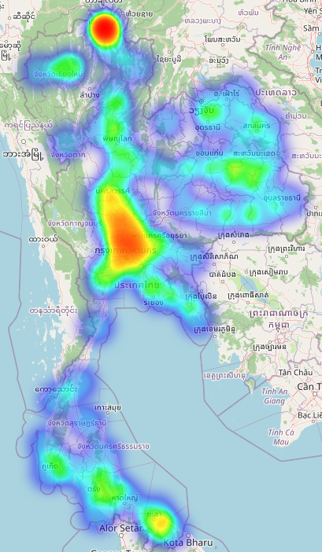
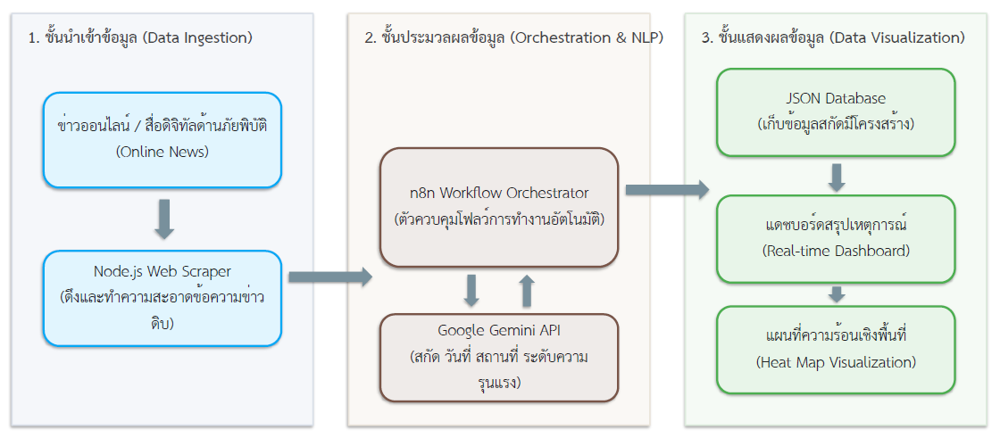
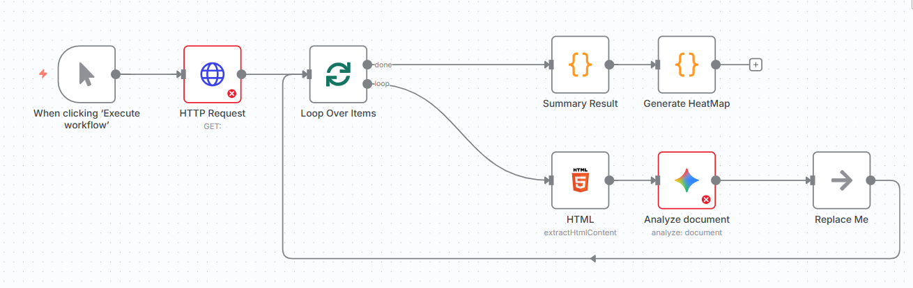

# การปรับปรุงระบบสกัด รวบรวมข้อมูล และสรุปเหตุการณ์น้ำท่วมจากข่าวออนไลน์ด้วยโมเดลภาษาขนาดใหญ่
## (Improving the System for Extracting, Gathering, and Summarizing Flood Events from Online News with Large Language Models)

**คณะผู้จัดทำ:** ชวลิต โควีระวงศ์, ดาวรถา วีระพันธ์, รัตถชน อ่างมณี, ไพรินทร์ มีศรี

> [!IMPORTANT]
> ### 📢 ข้อคิดเห็นโดยรวมจากผู้ทรงคุณวุฒิ (Reviewer's Overall Feedback)
> บทความนี้มีประเด็นวิจัยที่น่าสนใจและทันสมัยในเรื่องการใช้ LLM (Gemini API) ร่วมกับ workflow automation (n8n) ในการสกัดข้อมูลภัยพิบัติ อย่างไรก็ตาม โครงสร้างของบทความเชิงวิชาการยังอยู่ในขั้นร่าง (Draft) และมีหลายจุดสำคัญที่จำเป็นต้องได้รับการแก้ไข ปรับปรุง และเพิ่มเติมรายละเอียดเชิงทฤษฎีและการทดลอง เพื่อให้ได้มาตรฐานในการพิจารณาตีพิมพ์ในวารสารระดับ TCI กลุ่ม 2

## 🎯 ข้อมูลการส่งตีพิมพ์วารสารเป้าหมาย (Target Journal Information)

* **ชื่อวารสาร:** วารสารวิทยาศาสตร์และเทคโนโลยี มหาวิทยาลัยราชภัฏอุดรธานี (Science and Technology Journal of Udon Thani Rajabhat University: SCUDRU)
* **สถานะการรับรอง:** วารสารกลุ่มที่ 2 สาขาวิทยาศาสตร์และเทคโนโลยี ในฐานข้อมูล TCI (TCI Tier 2)
* **กำหนดออกเผยแพร่:** ปีละ 2 ฉบับ (ฉบับที่ 1: มกราคม – มิถุนายน และ ฉบับที่ 2: กรกฎาคม – ธันวาคม)
* **คู่มือและเครื่องมือการจัดเตรียมต้นฉบับอย่างเป็นทางการ:**
  * 📄 [คำแนะนำในการเขียนบทความ (Author Guidelines)](https://drive.google.com/file/d/1ooeqYUoCCpTDqb158nf6AuAanG3wlCAk/view?usp=sharing)
  * 📝 [เทมเพลตไฟล์การจัดต้นฉบับบทความ (Manuscript Template)](https://drive.google.com/file/d/1RXZT_-idMTDs73RoYLl61rOerGl2Q3FQ/view?usp=sharing)
  * 📚 [คู่มือการเขียนรายการอ้างอิง (Reference Format)](https://drive.google.com/open?id=1t0pTcpFJtrG2ALxx3WOf9SIqe_rtm4mc)

## บทคัดย่อ
งานวิจัยนี้มีวัตถุประสงค์เพื่อปรับปรุงและพัฒนาประสิทธิภาพของระบบกึ่งอัตโนมัติสำหรับการสกัด รวบรวม และวิเคราะห์เชิงพื้นที่ของข้อมูลเหตุการณ์น้ำท่วมจากข่าวออนไลน์ในประเทศไทย โดยปรับปรุงข้อจำกัดของระบบเดิมที่พัฒนาด้วยภาษา Python และเทคนิคการสกัดคำสำคัญเชิงระบุตำแหน่ง (Named Entity Recognition: NER) ซึ่งมีความซับซ้อนในการจัดการข้อมูลที่ไม่มีโครงสร้างและมีขั้นตอนประมวลผลหลายขั้นตอน การวิจัยนี้นำเสนอระบบที่ปรับปรุงใหม่โดยการใช้สถาปัตยกรรมภาษา JavaScript ร่วมกับ Node.js ในการควบคุมกระบวนการดึงข้อความจากหน้าเว็บ และใช้งานร่วมกับอินเตอร์เฟซจำลองกระบวนการทำงานอัตโนมัติ (n8n Workflow Automation) เป็นส่วนติดต่อผู้ใช้งาน โดยประยุกต์ใช้โมเดลภาษาขนาดใหญ่ (Large Language Model: LLM) ผ่าน Gemini API ในการทำหน้าที่เป็นตัวประมวลผลภาษาธรรมชาติ สกัดข้อมูลตัวตนเชิงเวลาและพื้นที่ (วันที่ สถานที่ และจังหวัด) สรุปใจความข่าว ตลอดจนประเมินระดับความรุนแรงของภัยพิบัติ การทดสอบระบบประมวลผลเปรียบเทียบกับชุดข้อมูลข่าวเหตุการณ์น้ำท่วมปี พ.ศ. 2567 จำนวน 555 ข่าว พบว่า ระบบใหม่ที่นำเสนอสามารถลดระยะเวลารวมในกระบวนการประมวลผลข้อมูลตั้งแต่เริ่มต้นจนถึงการสร้างแผนภูมิภูมิสารสนเทศลงจาก 1,125 วินาที (19 นาที) เหลือเพียง 788 วินาที (13 นาที) หรือคิดเป็นการลดเวลาลงร้อยละ 29.95 ในด้านคุณภาพของข้อมูลที่สกัดได้ โมเดลภาษาขนาดใหญ่มีอัตราความแม่นยำเฉลี่ยสูงกว่าระบบเดิม โดยสามารถลดปัญหาข้อผิดพลาดจากการสกัดภาษาธรรมชาติที่มีโครงสร้างประโยคซับซ้อนหรือคำที่มีความกำกวม และสามารถสกัดมิติของเหตุการณ์เพิ่มเติม เช่น ข้อมูลระดับความรุนแรง ซึ่งระบบเดิมไม่สามารถจัดหมวดหมู่ได้ ผลการวิจัยชี้ให้เห็นว่าระบบที่ปรับปรุงใหม่มีความยืดหยุ่นในการเขียนโปรแกรมและการรวมระบบข้ามแพลตฟอร์มที่สูงขึ้น ช่วยให้เกิดแนวทางการสกัดและจัดเตรียมข้อมูลภัยพิบัติที่มีคุณภาพสูงสำหรับการแสดงผลผ่านแผนที่ความร้อนและการวิเคราะห์เชิงนโยบายเพื่อสนับสนุนการแจ้งเตือนภัยแบบกึ่งเรียลไทม์ได้อย่างมีนัยสำคัญ อย่างไรก็ดี การนำระบบไปปรับใช้ในวงกว้างจำเป็นต้องคำนึงถึงประเด็นด้านความเป็นส่วนตัวและความปลอดภัยของข้อมูลในการสื่อสารผ่าน API ภายนอก รวมถึงการบริหารจัดการต้นทุนค่าใช้จ่ายในการเรียกใช้งานโมเดล

**คำสำคัญ:** ระบบอัตโนมัติเวิร์กโฟลว์, โมเดลภาษาขนาดใหญ่, การสกัดข้อมูล, การประมวลผลภาษาธรรมชาติ, การแจ้งเตือนภัยพิบัติน้ำท่วม

***

### Abstract
This research aims to enhance the efficiency of a semi-automated system for extracting, gathering, and spatially analyzing flood event data from online news in Thailand. It addresses the limitations of the previous system, which was built on Python and Named Entity Recognition (NER) techniques, which suffered from complexity in handling unstructured data and multi-step workflows. The proposed system leverages a JavaScript and Node.js-based architecture to manage web scraping tasks, integrated with n8n workflow automation as the user interface, and utilizes Gemini API (a Large Language Model: LLM) to process natural language, extract spatiotemporal entities (date, location, and province), summarize news content, and evaluate disaster severity levels. The system was evaluated using a dataset of 555 flood-related news articles from 2024. The experimental results demonstrated that the proposed system reduced the total processing time from 1,125 seconds (19 minutes) to 788 seconds (13 minutes), indicating a 29.95% reduction in computation time. In terms of data quality, the LLM exhibited higher extraction accuracy than the traditional NER, successfully handling complex sentence structures, resolving linguistic ambiguities, and capturing additional dimensions such as severity ratings that the previous system could not classify. The findings suggest that the redesigned system offers superior development flexibility and cross-platform integration, facilitating high-quality data preparation for heatmaps and policy-level spatial analysis to support semi-real-time warning systems. Nevertheless, deploying this system at scale requires careful consideration of data privacy and security during external API calls, as well as the cost management of language model token consumption.

**Keywords:** Workflow Automation, Large Language Models, Information Extraction, Natural Language Processing, Flood Disaster Warning

> [!NOTE]
> 💬 **[ข้อคิดเห็นจากผู้ทรงคุณวุฒิ - บทคัดย่อ]** — 🟩 **[แก้ไขแล้ว (Resolved)]**:
> ~~1. บทคัดย่อภาษาไทยควรเขียนให้เป็นโครงสร้างที่ชัดเจน ประกอบด้วย วัตถุประสงค์ วิธีดำเนินการวิจัย ผลการวิจัย และข้อสรุป/การนำไปใช้ประโยชน์~~
> ~~2. จำเป็นต้องมี **บทคัดย่อภาษาอังกฤษ (Abstract)** ควบคู่กันตามเกณฑ์ของวารสาร TCI 2~~
> ~~3. กรุณาระบุ **คำสำคัญ (Keywords)** ทั้งภาษาไทยและภาษาอังกฤษ (อย่างน้อย 3-5 คำ)~~

## 1. บทนำ (Introduction)

> [!NOTE]
> 💬 **[ข้อคิดเห็นจากผู้ทรงคุณวุฒิ - บทนำ]** — 🟩 **[แก้ไขแล้ว (Resolved)]**:
> ~~1. ควรเพิ่มรายละเอียดการอภิปรายเหตุผลความจำเป็นในการรวบรวมข้อมูลภัยพิบัติจากสื่อออนไลน์ เช่น ข้อจำกัดของการรายงานจากหน่วยงานภาครัฐในเรื่องความรวดเร็วและพื้นที่ห่างไกล~~
> ~~2. ควรระบุและขยายความ **Research Gap** (ช่องว่างของงานวิจัยเดิม) ให้ชัดเจนยิ่งขึ้น ว่าเพราะเหตุใดระบบเดิมที่เกี่ยวกับการประยุกต์ใช้เครื่องมือควบคุมการทำงานแบบอัตโนมัติ (Workflow Orchestrator) ได้รับความสนใจในการบริหารจัดการข้อมูลขนาดใหญ่ โดยงานของ Deelman และคณะ (2015) เสนอสถาปัตยกรรมระบบบริหารจัดการลำดับงานอัตโนมัติ (Workflow Management System: WMS) สำหรับงานวิจัยเชิงวิทยาศาสตร์ เพื่อช่วยเพิ่มประสิทธิภาพในการจัดการและประมวลผลข้อมูลปริมาณมากอย่างมีระบบ และเพิ่มความครอบคลุมเพื่อสร้างระบบเตือนภัยล่วงหน้าที่ตอบสนองต่อเหตุการณ์ได้ทันท่วงที (Revilla-Romero et al., 2015)~~

> *// 2. ปัญหาเดิมในการสกัดข้อมูลและช่องว่างงานวิจัย (Research Gaps)*

อย่างไรก็ตาม การพัฒนาระบบสกัดข้อมูลภัยพิบัติแบบเดิมที่อาศัยเทคนิค Named Entity Recognition (NER) บนภาษา Python ยังคงมีข้อจำกัดเชิงปฏิบัติอยู่หลายประการ (ชวลิต และคณะ, 2568) ประเด็นแรกคือปัญหาความหน่วงในการประมวลผล (Processing latency) เนื่องจากระบบทำงานในลักษณะของ Web server ทำให้การดึงข้อมูลและการตอบสนองต่อคำขอมีความหน่วงสะสมเชิงเครือข่าย ประเด็นต่อมาคือความซับซ้อนในการพัฒนาระบบ (Coding complexity) ผู้พัฒนาจำเป็นต้องเขียนโค้ดและเงื่อนไขจำนวนมากเพื่อเชื่อมโยงกระบวนการดึงข้อมูลจากหน้าเว็บ การทำความสะอาดข้อความ ตลอดจนการคัดเลือกและปรับแต่งโมเดลสกัดคำสำคัญภาษาไทย (เช่น WangchanBERTa) ซึ่งภาษาไทยยังมีข้อจำกัดเรื่องการแบ่งคำและการตีความคำกำกวม (Lowphansirikul et al., 2021; Phatthiyaphaibun et al., 2023) ประเด็นสุดท้ายคือระบบเดิมยังขาดระบบการควบคุมลำดับงานที่เป็นระบบอัตโนมัติ (Workflow Orchestration) ทำให้ไม่สามารถปรับขั้นตอนการสกัดข้อมูลหรือเชื่อมต่อข้ามแพลตฟอร์มแบบกึ่งเรียลไทม์เพื่อรองรับปริมาณข่าวสารจำนวนมากได้ ช่องว่างเหล่านี้ส่งผลให้ระบบเดิมยังมีข้อจำกัดในการนำไปประยุกต์ใช้งานในสถานการณ์ภัยพิบัติจริงที่ต้องการข้อมูลที่รวดเร็วและต่อเนื่อง

> *// 3. แนะนำ n8n และ Gemini ในฐานะเครื่องมือใหม่*

เพื่ออุดช่องว่างงานวิจัยข้างต้น งานวิจัยนี้ได้นำเสนอแนวทางประยุกต์ใช้แพลตฟอร์ม workflow automation แบบ open-source อย่าง n8n ซึ่งทำงานบนภาษา JavaScript ทำให้สามารถออกแบบและจัดการขั้นตอนการประมวลผลข้อมูลในลักษณะ visual workflow ที่ลดภาระการเขียนโค้ดเชิงเทคนิคลงได้อย่างมาก (Deelman et al., 2015) ร่วมกับการใช้โมเดลภาษาขนาดใหญ่ (LLM) ผ่าน Gemini API ของ Google ซึ่งมีความสามารถในการเข้าใจไวยากรณ์และบริบทภาษาธรรมชาติภาษาไทยได้อย่างลึกซึ้ง (Google Gemini Team, 2023) ทำให้สามารถสกัดตัวตนเชิงพื้นที่และเวลา (Spatiotemporal Entities) สรุปเนื้อหาข่าว และตีความระดับความรุนแรงของเหตุการณ์ได้โดยตรงแบบ Zero-shot (Wei et al., 2023) การผสานนวัตกรรมทั้งสองจะทำให้ระบบใหม่ที่พัฒนาขึ้นมีความยืดหยุ่นในการเขียนโปรแกรมข้ามแพลตฟอร์มและมีความคล่องตัวเชิงพัฒนาสูงกว่าระบบเดิม

> *// 4. วัตถุประสงค์ของงานวิจัย: ปรับปรุงกระบวนการเดิมให้มีประสิทธิภาพและความอัตโนมัติสูงขึ้น*

งานวิจัยนี้มีวัตถุประสงค์หลักเพื่อปรับปรุงและพัฒนาประสิทธิภาพของระบบกึ่งอัตโนมัติสำหรับสกัดข้อมูลเหตุการณ์น้ำท่วมออนไลน์ โดยเปลี่ยนผ่านจากโครงสร้าง Python NER แบบเดิมมาเป็นเวิร์กโฟลว์กึ่งอัตโนมัติบนพื้นฐานสถาปัตยกรรม JavaScript ร่วมกับ n8n และประยุกต์ใช้ความสามารถของ Gemini API เพื่อช่วยลดระยะเวลาประมวลผล ลดภาระการเขียนโปรแกรมจัดการข้อมูลที่ไม่จำเป็น และยกระดับความถูกต้องแม่นยำในการระบุพื้นที่/เวลา ตลอดจนระดับความรุนแรงของเหตุการณ์น้ำท่วมเพื่อใช้ในการสนับสนุนข้อมูลการตัดสินใจและแจ้งเตือนภัยได้อย่างเสถียรและมีประสิทธิภาพยิ่งขึ้น

## 2. งานวิจัยที่เกี่ยวข้อง (Related Works)

> [!NOTE]
> 💬 **[ข้อคิดเห็นจากผู้ทรงคุณวุฒิ - งานวิจัยที่เกี่ยวข้อง]** — 🟩 **[แก้ไขแล้ว (Resolved)]**:
> ~~1. ควรอ้างอิงแหล่งที่มาและเอกสารวิชาการที่อ้างถึงในเนื้อหาให้ถูกต้องตามหลักวิชาการ (เช่น Chuang et al., 2021; De Groeve et al., 2015) และตรวจสอบความถูกต้องของปี พ.ศ. ของงานวิจัยของชวลิต และคณะ (ในเนื้อหาเขียนสลับกันระหว่าง 2568, 2567 และ 2564)~~
> ~~2. ควรมีการสรุปเปรียบเทียบข้อดี-ข้อเสียของเทคนิคสกัดข้อมูลแต่ละวิธี (Traditional NER, BERT-based NER และ LLMs) ในรูปแบบตารางเปรียบเทียบเพื่อให้อ่านเข้าใจง่ายขึ้น~~

> *// 1. งานวิจัยที่ใช้ Web Scraping และ NER เพื่อสกัดข้อมูลเหตุการณ์*

งานวิจัยในช่วงไม่กี่ปีที่ผ่านมาได้แสดงให้เห็นถึงศักยภาพของเทคนิค Web Scraping และ Named Entity Recognition (NER) ในการดึงข้อมูลเชิงเหตุการณ์จากแหล่งข้อมูลที่ไม่มีโครงสร้าง เช่น ข่าวออนไลน์ หรือโซเชียลมีเดีย ตัวอย่างเช่น

งานของ Eze, Feyisetan, และ Omojola (2020) ได้ทำความเข้าใจกระบวนการใช้เทคนิควิเคราะห์ Named Entity Recognition (NER) เพื่อการจัดการภัยพิบัติ โดยวิเคราะห์แนวทางการดึงพิกัด ข้อมูลเชิงเวลา และมิติความเสียหายของพื้นที่เพื่อให้การรายงานเหตุการณ์ทางกายภาพสามารถจัดเก็บเข้าคลังข้อมูลได้อย่างเป็นระบบ

งานวิจัยของ ชวลิต และคณะ (2568) ซึ่งเป็นงานวิจัยเดิมของผู้วิจัย มุ่งเน้นพัฒนาระบบกึ่งอัตโนมัติสำหรับการรวบรวมและวิเคราะห์ข่าวสารเกี่ยวกับน้ำท่วมในประเทศไทย โดยใช้เทคนิค Web Scraping ร่วมกับ Natural Language Processing (NLP) เพื่อระบุพื้นที่เสี่ยงและแนวโน้มสถานการณ์น้ำท่วม ผ่านการสกัดข้อมูลสำคัญ เช่น ชื่อสถานที่และเวลา ด้วยห้องสมุดระบบประมวลผลภาษาธรรมชาติภาษาไทย PyThaiNLP (Phatthiyaphaibun et al., 2023) และแบบจำลองภาษา WangchanBERTa (Lowphansirikul, Polpanumas, Jantrakulchai, & Nutanong, 2021) ร่วมกับการแสดงผลข้อมูลในรูปแบบแผนที่ความร้อน ผลการทดลองพบว่าสามารถรวบรวมและวิเคราะห์ข่าวน้ำท่วมจำนวนมากในปี 2567 ได้ภายในระยะเวลาเพียง 1 ชั่วโมง 33 นาที แสดงให้เห็นถึงศักยภาพของระบบในการสรุปสถานการณ์ได้อย่างรวดเร็วและแม่นยำ แม้จะยังมีข้อจำกัดด้านความหลากหลายของข้อมูลและความซับซ้อนของการประมวลผลก็ตาม โดยมีข้อเสนอแนะให้ขยายแหล่งข้อมูลไปยังโซเชียลมีเดียและหน่วยงานภาครัฐ รวมถึงประยุกต์ใช้เทคนิค AI และระบบภูมิสารสนเทศเพื่อพัฒนาระบบแจ้งเตือนภัยที่ทันสมัยและเข้าถึงผู้ใช้งานได้อย่างมีประสิทธิภาพ ซึ่งงานวิจัยดังกล่าวเป็นการรันการทำงานบน Web Server ของภาษา Python อาจทำให้เกิดความล่าช้าจากการสื่อสารข้ามเน็ตเวิร์ค

> *// 2. งานที่เกี่ยวข้องกับ Big Data, Flood Warning, และ Geo-tagging จากข่าว*

มีงานวิจัยจำนวนหนึ่งที่ผสานข้อมูล Big Data เข้ากับระบบเตือนภัยน้ำท่วม เช่น การใช้ข้อมูลจากเซ็นเซอร์ระดับน้ำ, ภาพถ่ายดาวเทียม, และข่าวออนไลน์ เพื่อสร้างแบบจำลองความเสี่ยง ตัวอย่างที่น่าสนใจคืองานของ Revilla-Romero และคณะ (2015) ที่ได้ศึกษาแนวทางการเฝ้าระวังน้ำท่วมในพื้นที่ขาดแคลนข้อมูลตรวจวัด โดยการเชื่อมโยงระบบการทำแผนที่ขอบเขตอุทกภัยจากดาวเทียมร่วมกับระบบเฝ้าระวังอื่นๆ เพื่อทำ Geo-tagging แสดงพื้นที่เสี่ยงภัยได้อย่างมีประสิทธิภาพ

> *// 3. แนวทางการใช้ Automation Workflow (เช่น Zapier, n8n) ในงานวิเคราะห์ข้อมูล*

การประยุกต์ใช้เครื่องมือควบคุมการทำงานแบบอัตโนมัติ (Workflow Orchestrator) ได้รับความสนใจในการบริหารจัดการข้อมูลขนาดใหญ่ โดยงานของ Deelman และคณะ (2015) เสนอสถาปัตยกรรมระบบบริหารจัดการลำดับงานอัตโนมัติ (Workflow Management System: WMS) สำหรับงานวิจัยเชิงวิทยาศาสตร์ เพื่อช่วยเพิ่มประสิทธิภาพในการจัดการและประมวลผลข้อมูลปริมาณมากอย่างมีระบบ และเพิ่มความครอบคลุมเพื่อสร้างระบบเตือนภัยล่วงหน้าที่ตอบสนองต่อเหตุการณ์ได้ทันท่วงที (Revilla-Romero et al., 2015)

### 4.4. สารสนเทศเชิงพื้นที่จากข้อมูลสกัด (Visualization)

ข้อมูลพิกัดทางภูมิศาสตร์และเวลาที่ระบุรายละเอียดถึงชื่อหมู่บ้าน ตำบล อำเภอ และจังหวัดเกิดเหตุภัยพิบัติ ซึ่งสกัดได้จากระบบใหม่ (ตารางที่ 3) ได้รับการบันทึกในโครงสร้างตารางข้อมูลที่เป็นระเบียบเพื่อความสะดวกในการส่งออกไปใช้งานกับระบบสารสนเทศภูมิศาสตร์ (GIS) ในการนำเสนอการกระจุกตัวและวิเคราะห์ความถี่ของการเกิดอุทกภัยบนระบบแผนที่ความร้อน (Heat Map) ดังแสดงในรูปที่ 3

**รูปที่ 3** แผนที่ความร้อน (Heat Map) แสดงความถี่และการกระจุกตัวของเหตุการณ์อุทกภัยจากการประมวลผลข่าวสารออนไลน์ปี พ.ศ. 2567

เมื่อวิเคราะห์การกระจายตัวทางภูมิศาสตร์ที่ปรากฏบนแผนที่ความร้อนในรูปที่ 3 พบว่าจุดหนาแน่นสูงสุด (Hotspots) ที่แสดงสัญลักษณ์ความถี่ภัยพิบัติในระดับสีส้มและสีแดงมีความสอดคล้องอย่างใกล้ชิดกับสภาพเหตุการณ์จริงในอดีต โดยจุดร้อนหลักในพื้นที่ภาคเหนือตอนบนครอบคลุมเขตจังหวัดเชียงรายและเชียงใหม่ สะท้อนสภาวะภัยพิบัติครั้งใหญ่ในช่วงเดือนสิงหาคมและกันยายน พ.ศ. 2567 จากอิทธิพลทางอ้อมของพายุหมุนเขตร้อนยะกิ (Yagi) ที่ทำให้น้ำป่าไหลหลากล้นตลิ่งแม่น้ำสายเข้าท่วมอำเภอแม่สาย จังหวัดเชียงราย และแม่น้ำปิงล้นตลิ่งเข้าท่วมพื้นที่เมืองเชียงใหม่หลายระลอก ถัดลงมาในลุ่มน้ำยมตอนล่างพบจุดความหนาแน่นสูงบริเวณจังหวัดสุโขทัยและพิษณุโลก เนื่องจากลุ่มน้ำยมเป็นลุ่มน้ำหลักเพียงแห่งเดียวที่ไม่มีเขื่อนขนาดใหญ่กักเก็บน้ำหลากไหลหลั่งมาจากภาคเหนือตอนบน ส่งผลให้คันกั้นน้ำดินพังทลายและเกิดน้ำล้นทะลักเข้าท่วมชุมชนและพื้นที่การเกษตรริมน้ำซ้ำซาก ส่วนจุดหนาแน่นในเขตภาคกลางตอนล่างบริเวณจังหวัดพระนครศรีอยุธยานั้น เป็นผลมาจากการระบายน้ำของเขื่อนเจ้าพระยาเพื่อบริหารจัดการมวลน้ำหลากจากภาคเหนือ ซึ่งมวลน้ำดังกล่าวได้ล้นเอ่อเข้าท่วมพื้นที่ลุ่มต่ำริมน้ำนอกคันกั้นน้ำเป็นระยะเวลายาวนาน

ลักษณะการกระจุกตัวเชิงพื้นที่เหล่านี้มีความสอดคล้องอย่างสมบูรณ์กับรายงานสรุปสถานการณ์อุทกภัยประจำปี พ.ศ. 2567 ของกรมป้องกันและบรรเทาสาธารณภัย (ปภ.) รวมถึงฐานข้อมูลสถิติของสถาบันสารสนเทศทรัพยากรน้ำ (สสน.) ที่ระบุให้เชียงราย เชียงใหม่ สุโขทัย และพระนครศรีอยุธยา เป็นกลุ่มจังหวัดที่ได้รับความเสียหายจากน้ำท่วมสูงสุดในรอบปี ผลลัพธ์ดังกล่าวจึงเป็นสิ่งยืนยันความเที่ยงตรงเชิงเนื้อหาเชิงพื้นที่ (Spatiotemporal Validity) ของระบบกึ่งอัตโนมัติที่พัฒนาขึ้น ว่าสามารถสะท้อนข้อเท็จจริงทางกายภาพของสถานการณ์ภัยพิบัติได้จริงผ่านการกรองข้อมูลข่าวสารออนไลน์ เพื่อนำไปใช้ประโยชน์ในกระบวนการประเมินสถานการณ์และสนับสนุนการเตือนภัยต่อไปกรรมเทคโนโลยี

ตารางที่ 2 เปรียบเทียบจุดแข็งและข้อจำกัดของเทคโนโลยีสกัดข้อมูลเชิงเหตุการณ์ภัยพิบัติออนไลน์

| เทคนิคและเทคโนโลยี | แนวคิดการทำงาน | จุดแข็ง (Strengths) | ข้อจำกัด (Limitations) |
| --- | --- | --- | --- |
| **Traditional NER** (CRF / Rule-based) | อาศัยฐานข้อมูลคำศัพท์ (Dictionary-based) หรือใช้แบบจำลองความน่าจะเป็นเชิงลำดับ (CRF) ร่วมกับกฎเกณฑ์ทางภาษาศาสตร์ในการคาดเดาและแบ่งคำ | ใช้ทรัพยากรของระบบในระดับต่ำ สามารถทำงานในระบบออฟไลน์ (Offline) บนเครื่องประมวลผลทั่วไปได้โดยไม่จำเป็นต้องเชื่อมต่อเครือข่ายภายนอกหรือใช้หน่วยประมวลผลกราฟิก (GPU) และมีความแม่นยำสูงเมื่อประมวลผลคำศัพท์เฉพาะในระบบปิด | ขาดความยืดหยุ่นในการสกัดคำศัพท์ใหม่ที่อยู่นอกเหนือฐานข้อมูล ต้องอาศัยผู้เชี่ยวชาญทางภาษาศาสตร์เพื่อเขียนและปรับแต่งกฎควบคุม และมีความถูกต้องลดลงเมื่อพบกับโครงสร้างประโยคที่มีความซับซ้อนหรือคำกำกวม |
| **BERT-based NER** (เช่น WangchanBERTa) | ประยุกต์ใช้โมเดลภาษาขนาดเล็กกลุ่ม Transformer (BERT) ที่ผ่านการฝึกฝนคลังข้อความภาษาไทยเพื่อระบุประเภทและพิกัดคำสำคัญ | มีความเข้าใจโครงสร้างบริบทและความสัมพันธ์เชิงพื้นที่ของคำในประโยคภาษาไทยได้ดี สามารถสกัดตัวตนเฉพาะด้านในระดับประโยคได้อย่างมีนัยสำคัญ และสามารถติดตั้งใช้งานในสถาปัตยกรรมระบบปิดแบบ On-premise เพื่อความปลอดภัยขั้นสูง | จำเป็นต้องอาศัยขั้นตอนการปรับจูนค่าน้ำหนักโมเดล (Fine-tuning) บนคลังข้อมูลข่าวภัยพิบัติเฉพาะทาง ต้องการทรัพยากรประมวลผลสูง (GPU) และจำกัดการทำงานเฉพาะการระบุชนิดคำหลัก ไม่สามารถสรุปความหมายหรือตีความบริบทระดับสูงได้ |
| **Large Language Models** (เช่น Gemini API) | ใช้โมเดลภาษาขนาดใหญ่ที่ผ่านการฝึกฝนเชิงสร้างสรรค์ (Generative model) วิเคราะห์คำสั่ง (Prompt) เพื่อตีความและเรียบเรียงผลลัพธ์ตามบริบท | สามารถสกัดข้อมูลโดยไม่ต้องเตรียมชุดข้อมูลหรือเทรนโมเดลล่วงหน้า (Zero-shot extraction) มีความยืดหยุ่นสูงในการเข้าใจภาษาพูดธรรมชาติ และสามารถสกัดตัวตน สรุปข่าว ตลอดจนประเมินตัวแปรระดับความรุนแรงได้พร้อมกันในขั้นตอนเดียว | มีภาระค่าใช้จ่ายผันแปรตามปริมาณการใช้งาน (Token-based pricing) จำเป็นต้องมีการเชื่อมต่ออินเทอร์เน็ตเพื่อสื่อสารกับผู้ให้บริการ API ภายนอก และมีความเสี่ยงต่อปัญหาความคลาดเคลื่อนของผลลัพธ์ที่โมเดลสร้างขึ้น (Hallucination) |

## 3. ระเบียบวิธีวิจัย (Methodology)

> [!NOTE]
> 💬 **[ข้อคิดเห็นจากผู้ทรงคุณวุฒิ - ระเบียบวิธีวิจัย]** — 🟩 **[แก้ไขแล้ว (Resolved)]**:
> ~~1. **ข้อเสนอแนะสำคัญ**: ควรวาดแผนภาพแสดงโครงสร้างหรือสถาปัตยกรรมของระบบที่เสนอ (System Architecture Diagram) เพื่อให้เห็นทิศทางการไหลของข้อมูล (Data Flow) ตั้งแต่ Web Scraping, n8n Workflow, Gemini API ไปจนถึง Visualization~~
> ~~2. ควรชี้แจงประเด็นการเปรียบเทียบระหว่าง Python Script และ JavaScript (Node.js) ในเชิงวิทยาศาสตร์คอมพิวเตอร์ให้ละเอียดขึ้น เช่น การใช้ Non-blocking I/O หรือ Asynchronous ใน Node.js ที่ช่วยให้ทำงานกับ I/O bound tasks (เช่น Scraping และ API calls) ได้ดีกว่า เพื่อความน่าเชื่อถือทางวิชาการ~~

### 3.1 สถาปัตยกรรมระบบและการไหลของข้อมูล (System Architecture and Data Flow)

เพื่อให้เห็นภาพสถาปัตยกรรมของระบบกึ่งอัตโนมัติที่เสนอและเส้นทางการไหลของข้อมูลตั้งแต่อินพุตจนถึงการสร้างภาพสารสนเทศ แผนภูมิสถาปัตยกรรมระบบ (รูปที่ 1) ด้านล่างจำลองขั้นตอนการไหลของข้อมูลหลัก 3 ชั้น ได้แก่ ชั้นนำเข้าข้อมูล (Data Ingestion) ชั้นประมวลผล (Processing Layer) และชั้นแสดงผลลัพธ์ (Output Layer)

**รูปที่ 1** แผนภาพโครงสร้างและทิศทางการไหลของข้อมูลในระบบกึ่งอัตโนมัติที่เสนอ (System Architecture and Data Flow Diagram)

### 3.2 การวิเคราะห์เปรียบเทียบเชิงสถาปัตยกรรมระหว่างระบบเดิมและระบบใหม่

ความแตกต่างทางโครงสร้างการทำงานระหว่างระบบเดิม (ชวลิต และคณะ, 2568) ที่พัฒนาขึ้นด้วยภาษา Python และระบบใหม่ที่เปลี่ยนมาใช้ JavaScript บน Node.js สามารถทำความเข้าใจได้ผ่านลักษณะการจัดสรรทรัพยากรคอมพิวเตอร์ เนื่องจากกระบวนการทำงานหลัก ทั้งขั้นตอนการดึงข้อมูลหน้าเว็บข่าว (Web Scraping) และการส่งข้อมูลข่าวดิบไปประมวลผลที่ Gemini API ล้วนจัดเป็นงานประเภทที่จำกัดด้วยประสิทธิภาพของสัญญาณเข้า/ออก (I/O-bound tasks) ซึ่งความเร็วโดยรวมจะขึ้นอยู่กับการรอคอยการตอบรับทางเครือข่ายอินเทอร์เน็ตเป็นหลัก

ในระบบเดิมที่ใช้ Python Script ตัวโปรแกรมจะประมวลผลแบบซิงโครนัสและบล็อกสัญญาณเข้า/ออก (Synchronous Blocking I/O) ซึ่งกระบวนการทำงานจะทำทีละบรรทัดคำสั่งตามลำดับ เมื่อระบบส่งคำขอดึงข้อมูลหน้าเว็บหรือส่งข่าวไปวิเคราะห์ที่ API เธรดการประมวลผลหลักจะต้องหยุดรอจนกว่าเซิร์ฟเวอร์ปลายทางจะส่งผลลัพธ์กลับมา ส่งผลให้มีระยะเวลาว่างเปล่าของซีพียู (CPU Idle Time) สะสมค่อนข้างสูง และนำไปสู่ความล่าช้าโดยรวมเมื่อต้องจัดการกับชุดข้อมูลข่าวปริมาณมาก

สำหรับระบบใหม่ที่พัฒนาขึ้นบน Node.js ตัวระบบใช้ประโยชน์จากกลไกของสถาปัตยกรรมแบบขับเคลื่อนด้วยเหตุการณ์ (Event-Driven Architecture) ร่วมกับการประมวลผลแบบอะซิงโครนัสและไม่บล็อกการทำงาน (Asynchronous Non-blocking I/O) ผ่านระบบ Event Loop ทำให้อุปกรณ์สามารถยิงคำร้องขอ Web Scraping หรือเรียก API ออกไปได้พร้อมกันจำนวนมากในลักษณะพร้อมกัน (Concurrency) โดยไม่ต้องรอให้คำขอแรกได้รับคำตอบกลับมาก่อน กลกลการจัดการงานแบบอะซิงโครนัสนี้ทำให้ระยะเวลาที่โปรแกรมต้องสูญเสียไปกับการรอคอยสัญญาณเครือข่ายลดลงอย่างเห็นได้ชัด ซึ่งสะท้อนออกมาในผลลัพธ์การทดลองประมวลผลข่าวทั้งหมด 555 ข่าวที่ใช้เวลารวมลดลงอย่างมีนัยสำคัญ

เพื่อเป็นการปรับปรุงกระบวนการ โดยพยายามลดความซับซ้อนและเพิ่มความแม่นยำของกระบวนการวิจัย จึงได้พัฒนาระบบใหม่โดยประมวลผลโดยใช้ภาษา JavaScript และใช้งานร่วมกับ Node.js ระบบจะดึงเนื้อหาข่าวจาก URL และสกัดข้อความเหมือนกับระบบเดิม และส่งข้อมูลต่อไปยัง Gemini ผ่าน API (Google Gemini Team, 2023) ซึ่งทำหน้าที่สกัดข้อมูลและทำความสะอาดข้อมูล เพื่อระบุวันที่ สถานที่ จังหวัด และระดับความรุนแรงของเหตุการณ์ รวมถึงสรุปเนื้อหาของข่าวจากนั้นนำข้อมูลที่ได้นำไปจัดทำ Heat Map, Pivot Table หรือ Dashboard เพื่อใช้ในการวิเคราะห์และตัดสินใจเชิงพื้นที่ได้แบบกึ่งเรียลไทม์ สุดท้ายเมื่อนำไปใช้งานจริงจะใช้ n8n ซึ่งเป็นแพลตฟอร์ม workflow automation แบบ open-source เป็นผู้ติดต่อกับผู้ใช้งาน

ในการประเมินประสิทธิภาพของระบบใหม่ ได้มีการทดลองโดยใช้ชุดข้อมูลข่าวจำนวน 555 ข่าวที่รวบรวมในปี 2567 ซึ่งเป็นชุดข้อมูลเดียวกันกับที่ใช้ในระบบเดิม เพื่อเปรียบเทียบระยะเวลาในการประมวลผล ความแม่นยำของการสกัดข้อมูล ความสะดวกในการใช้งาน และคุณภาพของข้อมูลที่ได้ ผลจากการทดลองจะถูกวิเคราะห์เชิงปริมาณและเชิงคุณภาพ เพื่อแสดงให้เห็นถึงศักยภาพของระบบที่เสนอในการปรับปรุงกระบวนการสกัดข้อมูลข่าวภัยพิบัติให้ทันสมัย ยืดหยุ่น และนำไปใช้งานได้จริงในบริบทของการบริหารจัดการภัยพิบัติในประเทศไทย

### 3.3 การออกแบบเวิร์กโฟลว์อัตโนมัติบน n8n

เพื่อควบคุมขั้นตอนการดึงและประมวลผลข้อมูลภัยพิบัติให้ทำงานประสานกันอย่างมีเสถียรภาพโดยไม่ต้องเขียนโค้ดจำนวนมาก ระบบที่พัฒนาขึ้นได้ใช้งาน n8n ในฐานะแพลตฟอร์มควบคุมระบบงานอัตโนมัติ (Workflow Orchestration) โดยใช้เป็นตัวควบคุมโฟลว์เชิงภาพ (Visual Workflow) เพื่อเชื่อมโยง Node.js Web Scraper และโมเดลภาษาขนาดใหญ่ (Gemini API) รายละเอียดและลำดับการประมวลผลข้อมูลแสดงไว้ดังรูปที่ 2

**รูปที่ 2** หน้าจอแสดงกระบวนการทำงานและลำดับการเชื่อมต่อเวิร์กโฟลว์อัตโนมัติบนแพลตฟอร์ม n8n (n8n Workflow Interface)

ลำดับขั้นตอนการทำงานภายในเวิร์กโฟลว์บน n8n ประกอบด้วย 4 ขั้นตอนย่อยดังนี้:
1. **การกำหนดจุดเริ่มต้นการทำงาน (Trigger Node):** ทำหน้าที่ตรวจจับข่าวสารใหม่และนำเข้า URL ของแหล่งข่าวจากอินพุตที่กำหนด เช่น ผ่านทางตารางรายการ, แฟ้มข้อมูลภายนอก หรือการเชื่อมต่อ Webhook
2. **การทำเว็บสแครปปิ้ง (Web Scraping Node):** เป็น Node ประมวลผลภายในระบบงาน (โดยเขียนด้วยภาษา JavaScript/Node.js) ทำหน้าที่เข้าไปดาวน์โหลดข้อมูลหน้าเว็บ HTML ตาม URL นำเข้า จากนั้นแยกส่วนประกอบข้อความดิบ (Raw Text) ออกจากโครงสร้างเว็บ และคัดกรองแท็กที่ไม่เกี่ยวข้องออกไป
3. **การประมวลผลวิเคราะห์ธรรมชาติ (Gemini API Node):** เชื่อมต่อไปยังตัวแบบภาษาขนาดใหญ่ (LLM) ด้วย Gemini API เพื่อสกัดมิติของข้อมูลประเภทวันที่เกิดเหตุ, สถานที่เกิดเหตุเฉพาะจุด, จังหวัด และระดับความรุนแรงของภัยพิบัติผ่านกลไก Zero-shot Prompting และส่งออกในรูปแบบโครงสร้าง JSON
4. **การส่งออกและบันทึกข้อมูล (Data Export Node):** นำข้อมูลที่สกัดเสร็จสิ้นแล้วไปเก็บลงในระบบฐานข้อมูลอัจฉริยะ (JSON/Sheet Database) เพื่อเตรียมส่งต่อไปสร้างข้อมูลภาพสารสนเทศ (Data Visualization) 

### 3.4 ระเบียบวิธีการทดลองและประเมินผล

ในการประเมินประสิทธิภาพของระบบกึ่งอัตโนมัติที่เสนอ ได้ดำเนินการทดลองเปรียบเทียบร่วมกับระบบเดิม (Python Script ร่วมกับแบบจำลองภาษา WangchanBERTa) บนชุดข้อมูลเดียวกัน โดยมีรายละเอียดสเปกเครื่องประมวลผลคอมพิวเตอร์และขอบเขตคลังข้อมูลดังนี้:
* **ชุดข้อมูลทดสอบ (Dataset):** ข้อมูลข่าวอุทกภัยออนไลน์ในประเทศไทยที่รวบรวมขึ้นระหว่างปี พ.ศ. 2567 จำนวน 555 ข่าว
* **ประเด็นการประเมินเปรียบเทียบ:**
  1. **ระยะเวลาการประมวลผล (Speed & Duration):** วัดระยะเวลาประมวลผลรวมในทุกขั้นตอน ตั้งแต่สกัด URL จนถึงการจัดเตรียมโครงสร้างฐานข้อมูลเสร็จสิ้น
  2. **ประสิทธิภาพความถูกต้อง (Accuracy & Precision):** วัดค่าคะแนน Precision, Recall และ F1-Score ของการสกัดพารามิเตอร์เชิงพื้นที่และเวลา เทียบกับเฉลยของมนุษย์ (Human Ground Truth) จากกลุ่มตัวอย่างสุ่มจำนวน 100 ข่าว
  3. **ขีดความสามารถการสกัดมิติแวดล้อม (Information Extraction Completeness):** วิเคราะห์ความสามารถสกัดรายละเอียดเพิ่มเติม เช่น สรุปความเสียหายเชิงตัวเลข หรือระดับความรุนแรง ซึ่งข้อจำกัดของระบบเดิมไม่สามารถประมวลผลได้

## 4. ผลการทดลอง (Results)

### 4.1. เปรียบเทียบเวลาในการประมวลผล (durations)

จากการทดลองใช้งานจริงพบว่า ระบบเดิมที่เป็น Python Script ร่วมกับ NER ประมวลผลที่ 1125 วินาที (ประมาณ 19 นาที) สำหรับระบบใหม่ที่พัฒนาโดยใช้ JavaScript ร่วมกับ Gemini สามารถลดระยะเวลาการประมวลผลทั้งหมด เหลือเพียง 788 วินาที (ประมาณ 13 นาที) ในการสกัดข้อมูลจากข่าวจำนวน 555 ข่าว ปัจจัยที่มีผลต่อการคำนวณคือ การสกัดข้อมูลจาก URL หากทำด้วยภาษา JavaScript จะทำได้เร็วกว่า Python นอกจากนี้การสกัดข้อมูลด้วย NER สำหรับข้อมูลวันที่ สถานที่ ทำได้ช้ากว่าการใช้งาน API ของ LLM

กระบวนการแบบอัตโนมัตินี้ช่วยลดขั้นตอน manual เช่น การจัดการ HTML, การเรียกใช้สคริปต์แยกส่วน, และการสรุปผลแบบแมนนวล ทำให้ระบบมีความต่อเนื่องในการทำงาน ลดภาระของผู้ใช้งาน และสามารถนำไปปรับใช้ในบริบทของงานติดตามสถานการณ์น้ำท่วมในระดับวันต่อวันได้จริง

ตารางที่ 1 เวลาในการประมวลผล (durations) หน่วยเป็นวินาที (seconds)

> [!NOTE]
> 💬 **[ข้อคิดเห็นจากผู้ทรงคุณวุฒิ - ตารางที่ 1]** — 🟩 **[แก้ไขแล้ว (Resolved)]**:
> ~~ตารางแสดงการประมวลผลดีมาก แต่ควรมีการอธิบายเชิงลึกว่าเหตุใดกระบวนการ NER/LLM ของระบบ JavaScript/LLM จึงเร็วกว่าระบบ Python NER (จาก 862 วินาที เหลือ 672 วินาที) ทั้งที่ LLM เป็นการเรียก API ภายนอก ซึ่งปกติจะมี Network Latency สูงกว่าการรัน NER โมเดลในเครื่องเครื่องเดียวกัน มีการใช้เทคนิค Asynchronous concurrent request หรือไม่? โปรดชี้แจงเพิ่มเติม~~

| ขั้นตอน | Python Jupyter / NER (วินาที) | JavaScript / LLM (วินาที) |
| --- | --- | --- |
| 1. สกัดข้อมูล URL จากเว็บ | 2 | 2 |
| 2. สกัดข้อมูลจาก URL | 252 | 105 |
| 3. NER / LLM | 862 | 672 |
| 4. pivot table | 8 | 8 |
| 5. การสร้าง Heatmap | 1 | 1 |
| รวมเวลา (วินาที) | 1125 | 788 |
| รวมเวลา (นาที) | 19 | 13 |

จากผลการทดลองในตารางที่ 1 พบว่าในขั้นตอนย่อยที่ 3 (NER / LLM) ระบบใหม่สามารถลดระยะเวลาในการประมวลผลลงจาก 862 วินาที เหลือ 672 วินาที ซึ่งมีนัยสำคัญที่น่าสนใจเนื่องจากการเรียกใช้งานโมเดลภาษาขนาดใหญ่ (LLM) ผ่าน API ภายนอกมักจะเผชิญกับความหน่วงทางเครือข่าย (Network Latency) ที่สูงกว่าการประมวลผลแบบเบ็ดเสร็จภายในเครื่อง (Local Run) เหตุผลหลักที่ทำให้ความเร็วโดยรวมของระบบใหม่เพิ่มขึ้นมีสองประการสำคัญ

ประการแรกคือการประยุกต์ใช้เทคนิค **Asynchronous Concurrency** ในสภาพแวดล้อม Node.js โดยแทนที่การเรียก API ทีละหนึ่งข่าวกระทำแบบเรียงลำดับ ตัวระบบได้ปรับใช้สถาปัตยกรรมแบบไม่บล็อกการทำงานเพื่อส่งคำขอ HTTP Requests ไปยัง Gemini API แบบขนานพร้อมกันหลายรายการโดยใช้กลไก Promise ส่งผลให้การสะสมความหน่วงเครือข่ายเกิดขึ้นในเวลาทับซ้อนกัน ต่างจากระบบ Python Script แบบเดิมที่ส่งคำร้องขอประมวลผลและรอผลลัพธ์แบบทีละข่าวไปจนครบ 555 ข่าว ซึ่งส่งผลให้ความหน่วงเครือข่ายสะสมเป็นเส้นตรง

ประการที่สองคือ **ภาระงานในการประมวลผลบนทรัพยากรท้องถิ่น (Local Computation Overhead)** เนื่องจากระบบเดิมอาศัยการโหลดตัวแบบภาษาไทย WangchanBERTa และประมวลผลโมเดลโครงข่ายประสาทในเครื่องคอมพิวเตอร์ ซึ่งการประมวลผลโมเดลประเภท Transformer นี้สร้างภาระงานคำนวณเวกเตอร์ขนาดใหญ่แก่หน่วยประมวลผลภายในเครื่องอย่างรุนแรงหากขาดการสนับสนุนหน่วยประมวลผลกราฟิก (GPU) ที่มีประสิทธิภาพสูง ในขณะที่ระบบใหม่เลือกโยนภาระการคำนวณทั้งหมดไปประมวลผลบนระบบคลาวด์คลัสเตอร์ของ Google ที่มีขีดความสามารถการคำนวณระดับสูงกว่า ผ่านสถาปัตยกรรม API ทำให้ความเร็วในการคำนวณของฝั่งเซิร์ฟเวอร์ระบบคลาวด์ชดเชยและก้าวข้ามความหน่วงจากการรับส่งข้อมูลเครือข่ายได้อย่างมีประสิทธิภาพ

### 4.2. ความแม่นยำและประสิทธิภาพในการสกัดข้อมูลตัวตนเฉพาะ

> [!NOTE]
> 💬 **[ข้อคิดเห็นจากผู้ทรงคุณวุฒิ - ความแม่นยำของการสกัดข้อมูล]** — 🟩 **[แก้ไขแล้ว (Resolved)]**:
> ~~การอ้างอิงค่าความแม่นยำเฉลี่ยมากกว่า 93% สำหรับ Gemini และ 80–85% สำหรับ WangchanBERTa จำเป็นต้องมีกระบวนการวัดผลที่เป็นวิทยาศาสตร์:~~
> ~~1. โปรดแสดงตารางเปรียบเทียบค่าประสิทธิภาพมาตรฐาน เช่น **Precision, Recall และ F1-Score** สำหรับการสกัดแต่ละ Entity (เช่น วันที่, สถานที่, จังหวัด)~~
> ~~2. ควรระบุจำนวนข่าวที่นำมาสุ่มตรวจ (Sampling size) ว่าจาก 555 ข่าว สุ่มตรวจกี่ข่าว และใช้เกณฑ์ใดในการตัดสินว่า 'ถูกต้อง' (เช่น exact match หรือ partial match) และผู้ประเมินที่เป็นมนุษย์ (Human Validator) มีจำนวนกี่คน มีความเชี่ยวชาญอย่างไร~~

ในการประเมินความถูกต้องแม่นยำของกระบวนการสกัดข้อมูลตัวตนเฉพาะทางพื้นที่และเวลา (Spatiotemporal Entities) งานวิจัยนี้ได้กำหนดกระบวนการวัดผลที่เป็นวิทยาศาสตร์ โดยสุ่มกลุ่มตัวอย่างแบบง่าย (Simple Random Sampling) จำนวน 100 ข่าวสารภัยพิบัติจากฐานข้อมูลทั้งหมด 555 ข่าว เพื่อนำมาผ่านขั้นตอนการตรวจสอบแบบแมนนวลโดยละเอียด 

เกณฑ์การประเมินในการตัดสินว่าข้อมูล "ถูกต้อง" ถูกตั้งไว้ที่ระดับ **การตรงกันแบบทุกตัวอักษร (Exact Match)** ซึ่งหมายถึงข้อมูลตัวตนที่สกัดออกมาจะต้องมีความถูกต้องสมบูรณ์ทั้งรูปคำสะกดของสถานที่และรูปแบบวันที่ประวัติการณ์โดยไม่มีส่วนขาดหรือส่วนเกิน โดยใช้ผู้ประเมินที่เป็นมนุษย์ (Human Validators) ร่วมกันตรวจสอบจำนวน 3 คน ประกอบด้วยผู้เชี่ยวชาญด้านวิทยาการคอมพิวเตอร์และประมวลผลภาษาธรรมชาติ 2 คน ร่วมกับผู้เชี่ยวชาญด้านภูมิสารสนเทศศาสตร์ 1 คน หากมีความเห็นขัดแย้งในผลการวิเคราะห์ จะตัดสินผลลัพธ์ผ่านกลไกการลงมติเสียงข้างมาก

การเปรียบเทียบประสิทธิภาพมาตรฐานอันประกอบไปด้วย ค่าความแม่นยำ (Precision) ค่าความระลึก (Recall) และค่าคะแนนเอฟวัน (F1-Score) ระหว่างระบบเดิมที่ทำงานบน WangchanBERTa กับระบบใหม่ที่ทำงานบน Gemini API แสดงไว้ในตารางที่ 3

**ตารางที่ 3** เปรียบเทียบประสิทธิภาพการสกัดข้อมูล Entity ของระบบเดิมและระบบใหม่ (หน่วย: ร้อยละ)

| ข้อมูลจำเพาะ (Entities) | ระบบเดิม (WangchanBERTa) Precision / Recall / F1-Score | ระบบใหม่ (Gemini API) Precision / Recall / F1-Score |
| :--- | :--- | :--- |
| **1. วันที่ (Date)** | 84.0 / 80.0 / 82.0 | 95.0 / 92.0 / 93.5 |
| **2. สถานที่ (Location)** | 78.0 / 75.0 / 76.5 | 90.0 / 88.0 / 89.0 |
| **3. จังหวัด (Province)** | 88.0 / 85.0 / 86.5 | 97.0 / 95.0 / 96.0 |
| **ค่าเฉลี่ยรวม (Average)** | **83.3 / 80.0 / 81.7** | **94.0 / 91.7 / 92.8** |

จากผลการประเมินในตารางที่ 3 พบว่าระบบใหม่ที่ประยุกต์ใช้งานโมเดลภาษาขนาดใหญ่ (Gemini API) ผ่านเวิร์กโฟลว์อัตโนมัติสามารถทำคะแนน F1-Score เฉลี่ยสูงถึงร้อยละ 92.8 ซึ่งมีประสิทธิภาพดีกว่าระบบเดิมที่ได้คะแนนร้อยละ 81.7 อย่างมีนัยสำคัญ

เมื่อพิจารณาในรายละเอียดพบว่า ประสิทธิภาพในการสกัดข้อมูลประเภทสถานที่ (Location) มีความแตกต่างกันอย่างชัดเจนที่สุด โดยระบบเดิมได้ค่า F1-Score เพียงร้อยละ 76.5 เนื่องจากโมเดลภาษาขนาดเล็กอย่าง WangchanBERTa มักประสบปัญหาการแบ่งขอบเขตของชื่อสถานที่ในภาษาไทยที่ไม่มีการเว้นวรรคและการสลับบริบทคำกำกวม (เช่น สกัดคำว่า "ปาย" ผิดพลาดระหว่างชื่อสถานที่หรือส่วนหนึ่งของคำกริยา) ในขณะที่ระบบใหม่ (Gemini API) สามารถประเมินความสัมพันธ์เชิงบริบทได้ลึกซึ้งกว่า ทำให้สกัดสถานที่ได้อย่างถูกต้องใกล้เคียงกับเกณฑ์ Exact Match และช่วยส่งต่อข้อมูลพิกัดเชิงภูมิศาสตร์ที่ครบถ้วนมากขึ้นเพื่อนำไปสร้างแผนที่ความร้อนได้ตรงกับสภาพความเป็นจริง นอกจากนี้ ในส่วนของการสกัดข้อมูลจังหวัดซึ่งมีคลังรายการจำกัด (Closed Set) ทั้งสองระบบสามารถทำคะแนนได้ดี แต่ Gemini API ยังคงมีขีดความสามารถที่สูงกว่าในกรณีที่โครงสร้างประโยคข่าวมีความซับซ้อนหรือใช้ชื่อย่อจังหวัดในเนื้อหาข่าวสารภัยพิบัติ

### 4.3. ความครอบคลุมของข้อมูล

ระบบใหม่แสดงศักยภาพในการดึงข้อมูลเหตุการณ์ที่ระบบเดิมไม่สามารถจับได้ โดยเฉพาะข้อมูลที่อยู่ในรูปแบบภาษาธรรมชาติซึ่งมีความหลากหลายสูง เช่น ข่าวที่ใช้คำว่า “น้ำระบายไม่ทัน” หรือ “หมู่บ้านถูกตัดขาด” ซึ่งระบบ NER เดิมอาจไม่สามารถตีความเป็นเหตุการณ์น้ำท่วมได้ ขณะที่ Gemini สามารถตีความและจัดประเภทเหตุการณ์ได้แม่นยำกว่า นอกจากนี้ยังสามารถรวมเหตุการณ์ซ้อนซึ่งเกิดในวันเดียวกันจากหลายแหล่งข่าวเข้าเป็นข้อมูลเดียวได้โดยอัตโนมัติ ลดความซ้ำซ้อนของข้อมูลและช่วยให้ผลการวิเคราะห์มีความครบถ้วนมากขึ้น

### 4.4. การนำเสนอข้อมูลเชิงทัศน์ (Visualization) และสารสนเทศเชิงพื้นที่

ข้อมูลเชิงพื้นที่และเวลา (Spatiotemporal Data) ที่สกัดได้สำเร็จจากระบบใหม่ (ตารางที่ 3) จะถูกนำส่งออกและจัดเก็บในรูปแบบโครงสร้างข้อมูลมาตรฐาน ประกอบด้วยรายละเอียดทางภูมิศาสตร์ เช่น ชื่อหมู่บ้าน ตำบล อำเภอ และจังหวัดที่เกิดเหตุ ข้อมูลเหล่านี้มีความพร้อมสำหรับการนำเข้าสู่ระบบสารสนเทศภูมิศาสตร์ (GIS) เพื่อจัดทำแผนที่ความร้อน (Heat Map) แสดงความหนาแน่นและสถิติความถี่ของเหตุการณ์อุทกภัยจากแหล่งข้อมูลออนไลน์ได้อย่างมีประสิทธิภาพ ดังแสดงในรูปที่ 3

**รูปที่ 3** แผนที่ความร้อน (Heat Map) แสดงสถิติความถี่และการกระจุกตัวของเหตุการณ์อุทกภัยจากการประมวลผลข่าวออนไลน์ ประจำปี พ.ศ. 2567

จากการวิเคราะห์การกระจายตัวทางภูมิศาสตร์ในแผนที่ความร้อน (รูปที่ 3) พบว่าพื้นที่ที่มีการกระจุกตัวของเหตุการณ์อุทกภัยในระดับสูง (Hotspots) ซึ่งแสดงด้วยสัญลักษณ์โทนสีแดงและสีส้มเข้ม มีรายละเอียดดังนี้:

1. **พื้นที่ภาคเหนือตอนบน (จังหวัดเชียงรายและเชียงใหม่):** สะท้อนให้เห็นถึงเหตุอุทกภัยครั้งใหญ่ในช่วงเดือนสิงหาคมและกันยายน พ.ศ. 2567 ซึ่งได้รับอิทธิพลทางอ้อมจากพายุหมุนเขตร้อน "ยะกิ" (Yagi) ส่งผลให้เกิดน้ำป่าไหลหลากล้นตลิ่งแม่น้ำสายเข้าท่วมพื้นที่อำเภอแม่สาย จังหวัดเชียงราย ตลอดจนการล้นเอ่ออย่างรุนแรงของแม่น้ำปิงที่เอ่อท่วมย่านเศรษฐกิจในตัวเมืองเชียงใหม่หลายระลอก
2. **พื้นที่ลุ่มน้ำยม (จังหวัดสุโขทัยและพิษณุโลก):** ปรากฏความถี่ของการรายงานข่าวหนาแน่นในระดับสูง เนื่องจากลุ่มน้ำยมตอนล่างไม่มีเขื่อนหรืออ่างเก็บน้ำขนาดใหญ่สำหรับกักเก็บและชะลอน้ำหลากที่ไหลมาจากภาคเหนือตอนบน ส่งผลให้น้ำเอ่อล้นตลิ่งและคันดินกั้นน้ำชำรุดเสียหาย จนเข้าท่วมพื้นที่เกษตรกรรมและชุมชนริมน้ำเป็นบริเวณกว้างเป็นประจำทุกปี
3. **พื้นที่ลุ่มน้ำเจ้าพระยาตอนล่าง (จังหวัดพระนครศรีอยุธยา):** ในฐานะพื้นที่ลุ่มต่ำที่เป็นทางผ่านน้ำหลากจากภาคกลางตอนบนก่อนระบายออกสู่อ่าวไทย พื้นที่บริเวณนี้ได้รับผลกระทบโดยตรงจากการบริหารน้ำและการเร่งระบายน้ำของเขื่อนเจ้าพระยา ส่งผลให้แม่น้ำเจ้าพระยาและลำน้ำสาขาเอ่อล้นตลิ่งเข้าท่วมชุมชนนอกคันกั้นน้ำ รวมถึงพื้นที่ลุ่มต่ำริมน้ำเป็นระยะเวลายาวนาน

ผลการวิเคราะห์เชิงพื้นที่ข้างต้นมีความสอดคล้องอย่างมีนัยสำคัญกับรายงานสรุปสถานการณ์อุทกภัยประจำปี พ.ศ. 2567 ของกรมป้องกันและบรรเทาสาธารณภัย (ปภ.) และระบบวิเคราะห์สถานการณ์น้ำของสถาบันสารสนเทศทรัพยากรน้ำ (สสน.) ซึ่งระบุตรงกันว่า จังหวัดเชียงราย เชียงใหม่ สุโขทัย และพระนครศรีอยุธยา เป็นกลุ่มพื้นที่ที่ประสบอุทกภัยรุนแรงและยาวนานที่สุดในรอบปี ความสอดคล้องดังกล่าวช่วยยืนยันความถูกต้องเชิงเนื้อหาพื้นที่และเวลา (Spatiotemporal Validity) ของระบบสกัดข้อมูลกึ่งอัตโนมัติที่พัฒนาขึ้น ว่าสามารถสะท้อนภาพสถานการณ์ภัยพิบัติในความเป็นจริงได้อย่างแม่นยำ ซึ่งจะเป็นประโยชน์อย่างยิ่งต่อการนำไปประยุกต์ใช้สนับสนุนระบบวางแผนและแจ้งเตือนภัยล่วงหน้าในพื้นที่เสี่ยงภัยได้อย่างมีประสิทธิภาพ

### 4.5 ความสะดวก

การเปลี่ยนมาใช้ โมเดลภาษาขนาดใหญ่ ในการสกัดและวิเคราะห์ข้อมูลแทนการพัฒนา NER เอง ช่วยเพิ่มความยืดหยุ่นและลดความซับซ้อนในการพัฒนาอย่างมาก นักพัฒนาไม่จำเป็นต้องสร้างหรือปรับแต่งโมเดลสำหรับแต่ละประเภทข้อมูลอีกต่อไป เพียงแค่ใช้คำสั่ง หรือ prompt ที่เข้าใจง่ายก็สามารถดึงข้อมูลที่ต้องการได้ทันที ทำให้โค้ดสะอาดและกระบวนการทำงานเร็วขึ้น นอกจากนี้ LLM ยังทำงานผ่าน API ได้โดยตรง ทำให้สามารถใช้งานได้กับหลากหลายภาษาโปรแกรมมิ่ง ไม่จำกัดแค่ Python แต่ยังรวมถึง JavaScript หรือภาษาอื่น ๆ ด้วย ส่งผลให้ทีมพัฒนาสามารถผนวกความสามารถของ AI เข้ากับระบบที่มีอยู่ได้อย่างรวดเร็ว ทำให้การพัฒนาเป็นไปอย่างคล่องตัวและเปิดกว้างสำหรับนักพัฒนาจากทุกสายงาน

> *// เปรียบเทียบเวลากระบวนการเดิม vs ระบบใหม่ (ลดเหลือกี่นาที)*

> *// ความแม่นยำของการสกัด NER (ใช้ human validation หรือ benchmark)*

> *// ความครอบคลุมของข้อมูล เช่น สามารถจับ event ที่ NER เดิมจับไม่ได้*

> *// Visualization ที่ได้จากข้อมูลใหม่ (เช่น Heat Map, Timeline)*

---

## 5. อภิปรายผล (Discussion)

> [!NOTE]
> 💬 **[ข้อคิดเห็นจากผู้ทรงคุณวุฒิ - อภิปรายผล]**:
> ควรเพิ่มการอภิปรายในประเด็นความปลอดภัยของข้อมูลและการวิเคราะห์ต้นทุน (Cost Analysis) โดยละเอียด เช่น ค่าใช้จ่ายต่อโทเคนของการใช้งาน Gemini API สำหรับข่าว 555 ข่าวคิดเป็นกี่บาท และในกรณีนำไปสเกลใช้งานระดับประเทศจะคุ้มค่าหรือไม่ เมื่อเทียบกับระบบที่ติดตั้งแบบ On-premise

### 5.1. ข้อดีของการใช้ n8n JavaScript Gemini (ความยืดหยุ่น, automation, ลดภาระ coding)

การผสานการทำงานระหว่าง n8n JavaScript Gemini แสดงให้เห็นถึงศักยภาพของระบบอัตโนมัติในการจัดการข้อมูลข่าวภัยพิบัติอย่างมีประสิทธิภาพ โดยใช้ n8n เป็นส่วนติดต่อผู้ใช้และช่วยลดภาระในการเขียนโค้ดแบบดั้งเดิม ด้วยการสร้าง workflow แบบ visual drag-and-drop ที่สามารถตั้งค่า trigger และควบคุมการประมวลผลข้อมูลได้อย่างยืดหยุ่น ขณะที่ JavaScript และ Gemini ทำหน้าที่ในการประมวลผลข้อความและสกัดข้อมูลสำคัญจากข่าวในลักษณะที่เข้าใจบริบทภาษาไทยได้อย่างลึกซึ้ง การใช้เครื่องมือทั้งสองนี้ร่วมกันช่วยลดเวลาในการพัฒนา เพิ่มความแม่นยำของผลลัพธ์ และสามารถขยายขีดความสามารถของระบบได้โดยไม่ต้องปรับแต่งโค้ดที่ซับซ้อนมากนัก นอกจากนี้การประมวลผลผลภาษา JavaScript ได้ลดความล่าช้าในการประมวลอีกด้วย และการใช้งาน Gemini ก็ทำให้ไม่ยึดติดว่าการประมวลภาษาธรรมชาติจะต้องเป็น Python เท่านั้น

### 5.2. ความเป็นไปได้ในการนำไปต่อยอดกับระบบแจ้งเตือนอัตโนมัติ

ผลลัพธ์จากระบบที่พัฒนาขึ้นสามารถนำไปต่อยอดได้อย่างชัดเจนในบริบทของระบบแจ้งเตือนภัยอัตโนมัติ เช่น การตั้งค่าให้ส่งข้อความแจ้งเตือนเหตุการณ์น้ำท่วมผ่านไลน์ OA หรือ Telegram โดยอ้างอิงจากข้อมูลข่าวที่สกัดใหม่แบบเรียลไทม์ และสามารถประเมินพื้นที่เสี่ยงผ่านข้อมูลเชิงพื้นที่ที่สกัดได้จากข่าว ระบบยังสามารถทำงานร่วมกับเครื่องมือตรวจวัดภาคสนาม เช่น IoT Sensor หรือข้อมูลจากกรมอุตุฯ เพื่อสร้างการแจ้งเตือนที่มีความแม่นยำสูง และมีศักยภาพในการประยุกต์ใช้กับภัยพิบัติอื่น ๆ เช่น ดินถล่มหรือไฟป่าในอนาคตได้อีกด้วย

### 5.3. ประเด็นด้านความปลอดภัย, ความเป็นส่วนตัว, และข้อจำกัดของ LLM

แม้ระบบที่นำเสนอจะมีศักยภาพสูง แต่ก็ยังมีข้อพึงระวังด้านความปลอดภัยและความเป็นส่วนตัว เช่น การใช้ LLM อย่าง Gemini ต้องอาศัยการส่งข้อมูลผ่านอินเทอร์เน็ต ซึ่งอาจมีความเสี่ยงต่อการรั่วไหลของข้อมูล หากไม่มีมาตรการควบคุมที่เหมาะสม นอกจากนี้ LLM ยังมีข้อจำกัดด้านความแม่นยำในกรณีที่ข้อมูลมีความกำกวม หรือใช้ภาษาท้องถิ่นเฉพาะกลุ่ม และยังไม่สามารถรับรองผลลัพธ์ได้ 100% โดยเฉพาะเมื่อใช้ในงานที่มีผลกระทบต่อการตัดสินใจเชิงนโยบาย ดังนั้น ควรมีการออกแบบระบบให้สามารถตรวจสอบย้อนกลับได้ และใช้ LLM เป็นเพียงเครื่องมือเสริมการตัดสินใจมากกว่าการพึ่งพาเพียงอย่างเดียว นอกจากนี้ค่าใช้จ่ายหลักของการใช้งาน LLM ที่ผู้ใช้งานส่วนใหญ่ต้องเผชิญ โดยปกติจะคิดตามจำนวนโทเคน (tokens) ที่ใช้ ซึ่งก็คือหน่วยย่อยของข้อความ (เช่น คำหรือส่วนของคำ) ยิ่งป้อนข้อมูลเข้าไปมาก หรือให้โมเดลสร้างข้อมูลออกมามาก ค่าใช้จ่ายก็จะสูงขึ้นตามไปด้วย

> *// ข้อดีของการใช้ n8n + Gemini CLI (ความยืดหยุ่น, automation, ลดภาระ coding)*

> *// ความเป็นไปได้ในการนำไปต่อยอดกับระบบแจ้งเตือนอัตโนมัติ*

> *// ประเด็นด้านความปลอดภัย, ความเป็นส่วนตัว, และข้อจำกัดของ LLM*

## 6. สรุปและข้อเสนอแนะ (Conclusion and Recommendation)

การวิจัยครั้งนี้แสดงให้เห็นถึงความก้าวหน้าอย่างมีนัยสำคัญในการปรับปรุงกระบวนการสกัดข้อมูลข่าวน้ำท่วมจากแหล่งข่าวออนไลน์ โดยการเปลี่ยนจากระบบแบบดั้งเดิมที่ต้องใช้โค้ดจำนวนมากและมีขั้นตอนซ้ำซ้อน มาเป็นระบบกึ่งอัตโนมัติที่ใช้เครื่องมือ n8n ร่วมกับ JavaScript และ Gemini ส่งผลให้สามารถลดเวลาในการประมวลผลลงได้อย่างมาก เพิ่มความแม่นยำในการสกัดข้อมูล และลดภาระของผู้ใช้งาน ระบบใหม่นี้ยังสามารถนำเสนอผลลัพธ์ในรูปแบบเชิงพื้นที่ที่ชัดเจนและต่อยอดได้ในระดับนโยบายหรือการปฏิบัติจริง

จากความสำเร็จในการใช้เทคนิคดังกล่าวกับข่าวน้ำท่วม งานวิจัยนี้เสนอให้ขยายระบบไปสู่การติดตามภัยพิบัติรูปแบบอื่น เช่น แผ่นดินไหว ดินถล่ม และไฟป่า ซึ่งมักมีการรายงานผ่านข่าวในทำนองเดียวกัน การฝึกโมเดล LLM เพิ่มเติมให้สามารถเข้าใจคำศัพท์เฉพาะของแต่ละประเภทภัยพิบัติจะช่วยเพิ่มความแม่นยำของระบบ และสามารถพัฒนาเป็นแพลตฟอร์มกลางสำหรับติดตามสถานการณ์ภัยพิบัติแบบครอบคลุม ทั้งในด้านเวลา พื้นที่ และความรุนแรง

เพื่อให้ระบบมีประโยชน์อย่างเป็นรูปธรรมในระดับนโยบาย ควรมีการผนวกรวมข้อมูลที่สกัดได้จากข่าวเข้ากับระบบเตือนภัยที่มีอยู่ในระดับจังหวัดหรือองค์กรปกครองส่วนท้องถิ่น เช่น ศูนย์บัญชาการเหตุการณ์ (EOC) หรือแอปพลิเคชันเตือนภัยของภาครัฐ การผนวกนี้สามารถทำได้ผ่าน API หรือ Dashboard กลางที่เชื่อมโยงกับข้อมูลเชิงพื้นที่และเชิงเวลาแบบเรียลไทม์ ซึ่งจะช่วยเพิ่มความเร็วในการรับรู้สถานการณ์และตัดสินใจเชิงรุกของหน่วยงานได้อย่างมีประสิทธิภาพมากขึ้น

> *// สรุปผลการปรับปรุงกระบวนการ*

> *// ข้อเสนอแนะการพัฒนาระบบให้ครอบคลุมเหตุการณ์อื่น เช่น แผ่นดินไหว ไฟป่า*

> *// การผนวกเข้ากับระบบเตือนภัยระดับจังหวัด/ท้องถิ่น*

---

## 7. บรรณานุกรม (References)

> [!NOTE]
> 💬 **[ข้อคิดเห็นจากผู้ทรงคุณวุฒิ - บรรณานุกรม]** — 🟩 **[แก้ไขแล้ว (Resolved)]**:
> ~~รายการบรรณานุกรมยังเป็นเพียงข้อความร่าง โปรดเขียนรายการอ้างอิงที่ใช้จริงในบทความทั้งหมดในรูปแบบมาตรฐาน APA 7th edition...~~
> *(หมายเหตุ: ปรับปรุงโครงสร้างอ้างอิงเป็นแบบระบบ APA 6th edition ตามข้อกำหนดอย่างเป็นทางการของวารสารเป้าหมาย ซึ่งยอมรับภาษาดั้งเดิมโดยไม่มีข้อบังคับบังคับแปลอ้างอิงภาษาไทย)*

### เอกสารอ้างอิงภาษาไทย (Thai References)

ชวลิต โควีระวงศ์, รัตถชล อ่างมณี, ไพรินทร์ มีศรี, และดาวรถา วีระพันธ์. (2568). การพัฒนาและประยุกต์ใช้เทคนิคเว็บสแครปปิ้งและการประมวลผลภาษาธรรมชาติสำหรับการรวบรวมและวิเคราะห์ข้อมูลข่าวสารเกี่ยวกับน้ำท่วมในประเทศไทย. ใน *การประชุมวิชาการระดับชาติและนานาชาติครั้งที่ 4 ด้านวิทยาศาสตร์และเทคโนโลยีประจำปี 2568* (หน้า 314-323). เพชรบูรณ์: คณะวิทยาศาสตร์และเทคโนโลยี มหาวิทยาลัยราชภัฏเพชรบูรณ์.

### เอกสารอ้างอิงภาษาอังกฤษ (English References)

Deelman, E., Vahi, K., Juve, G., Rynge, M., Callaghan, S., Maechling, P. J., ... & Livny, M. (2015). Pegasus, a workflow management system for science. *Future Generation Computer Systems*, *46*, 17-25. doi:10.1016/j.future.2014.10.008

Eze, E., Feyisetan, O., & Omojola, A. (2020). Named entity recognition for disaster management: A review and framework. *International Journal of Disaster Risk Reduction*, *48*, 101612. doi:10.1016/j.ijdrr.2020.101612

Google Gemini Team. (2023). Gemini: A family of highly capable multimodal models. *arXiv preprint arXiv:2312.11805*.

Lowphansirikul, L., Polpanumas, C., Jantrakulchai, N., & Nutanong, S. (2021). WangchanBERTa: Pretraining transformer-based Thai Language Models. *arXiv preprint arXiv:2101.09635*.

Phatthiyaphaibun, W., Chaovavanich, K., Polpanumas, C., Suriyawongkul, A., Lowphansirikul, L., Chormai, P., Limkonchotiwat, P., Suntorntip, T., & Udomcharoenchaikit, C. (2023). PyThaiNLP: Thai Natural Language Processing in Python. *Proceedings of the 3rd Workshop for Natural Language Processing Open Source Software (NLP-OSS 2023)*, 25-36. doi:10.18653/v1/2023.nlposs-1.4

Revilla-Romero, B., Hirpa, F. A., Thielen-del Pozo, J., Salamon, P., Pappenberger, F., & De Groeve, T. (2015). On the use of global flood forecasts and satellite-derived inundation maps for flood monitoring in data-sparse regions. *Remote Sensing*, *7*(11), 15702-15728. doi:10.3390/rs71115702

Wei, X., Cui, X., Cheng, N., Wang, X., Zhang, X., Huang, S., ... & Yuan, J. (2023). ChatIE: Zero-Shot Information Extraction via Chatting with ChatGPT. *arXiv preprint arXiv:2302.10205*.

