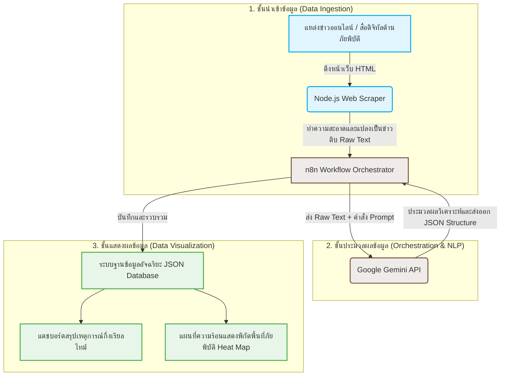

# โค้ดสำหรับสร้างแผนภาพสถาปัตยกรรมระบบ (Mermaid Code for Figure 1)

ไฟล์นี้จัดเก็บซอร์สโค้ด Mermaid ที่ใช้สร้างแผนภาพสถาปัตยกรรมระบบกึ่งอัตโนมัติและการไหลของข้อมูล (System Architecture and Data Flow Diagram) ของบทความวิจัย

## Mermaid Code

